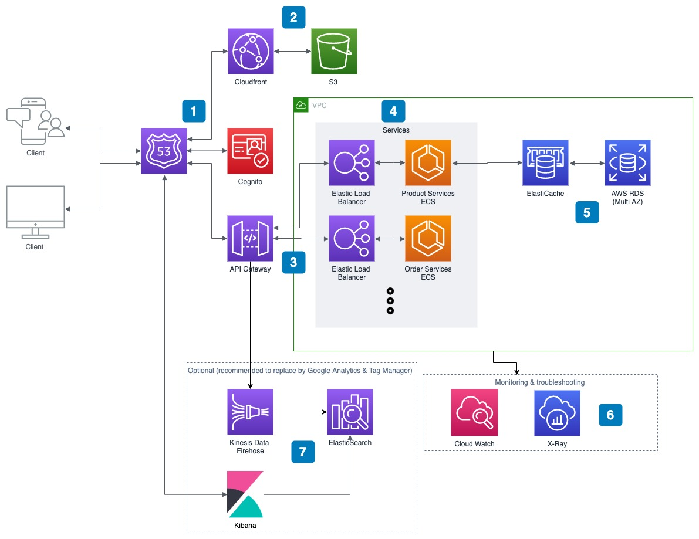

# MVP design of an online shopping application

## Problem statement
A small start-up named "XYZ" wants to build a very simple online shopping application to sell their products. In order to get to the market quickly, they just want to build an MVP version with a very limited set of functionalities:
* the application is simply a single web page that shows all products on which customer can filter, short and search for products based on different criteria such as name, price, branch, colour etc.
* if customer finds a product that they like, they can only place order by calling to the company's Call Centre
* to support sale and marketing, all customers' activities such as searching, filtering and viewing product's details
need to be stored in the database.
* no customer registration is required
* no online payment is supported yet

## Solution architect



**1) Routing and authentication / authorization**

Route53 is used to direct traffice to web site
Cognito is used as user pool and user directory for self-signup, authentication with different social media identity provider and act as API authroizer.

**2) Website and static content hosting**

Our website content is hosted on S3 and distributed through CloudFront for global customers.
Besides that static file / media of the product is also stored in S3 and served global customers through cloudfront.

**3) API provider**

Backend API is served through API gateway for diffirent benefits:
* Secuirty / Throttling / authentication / authorization / scalability
We can use one API gateway for the whole system (multiple microservices) or depends on later expansion we and use a different API gateway for other set of APIs & services.

**4) Backend API microservices**

The online shopping system contains of multiple microservice for different domains: product catalog management, Order management, Billing and invoice managemant services, ect ...
* Each microservice (or each domain system) is deployed into **ECS cluster** to indepent scaling and own its own data.
* For the demo purpose and the MVP version of the product, only the **product service** is needed in this version.
* Each **ECS cluster** contains its own **Elastc load balancer**, **autoscaling group**, **containers on EC2**.
* API gateway direct the traffic to ECS through its load balancer.

**5) Database and caching**

Since product, product catalog are rarelly changed information and user has more read frequency than product update, **product service** it is a read frequently (or read heavy) service. Therefore, an **ElastiCache** cluster is added infront the database to cache the frequenly browser product and reduce workload on DB site.

**6) Monitoring and logging**

We will use Cloudwatch / XRay for logging and troubleshooting. We can choose either one of them. 

**7) User behavior tracking**

Recommended to use **Google Analytics** and **Tag manager** to fast delivery and easy maintained by Marketing, sale people. They can freely track what they want. Google analytics provide plenttly of feature for analyze user behavior. We can track page, browsed product & search criteria by submitting customer metric and dimension.

In case, we don't want these data is stored in Google and implement our own solution. We can make use of API access log, digest it through Kenisis Firehose and persist to ElasticSearch for analysing.

## ERD Diagram

In this demo, only the product service required in MVP is designed in detail.
Following problem or aspect is not taken care of :
* provide localization and language translation for name and description, etc.. of product catalog, product and branch.
* No other entity for pricing management system like : currency, promotion, ...  


## Class Diagram
To simplify the diagram, all the fields and method are not documented.


## Implementation and How to run
Thing which is not included in the demo product service:
* No AWS stuff there yet
* Separated view and write DTO and using DTO
* Reduce layer for the demo by removing service layer.
* No setup Docker registry yet. So please don't push it.

**Demo includes:**
* Run and build the solution either via Docker (to make application deployable later to ECS) or normal spring boot application. 
* Integrate maven build cycle with docker build cycle via dockermaven plugin.
* Demonstrate JPA / ORM; using Spring Data JPA, lombok, introduce mapstruct 
* Demonstrate Spring & Maven profile usage; env variable
* Just a small integration is provided
* Initialize some data via CommandLineRunner

**How to run**
Build the solution
```
 mvn package //with docker image built
 or
 mvn -Ddockerfile.skip package //without docker image built
```

Launch it
```
 mvn spring-boot:run
 or
 docker run -p 8080:8080 trankietnhi/springdemo:0.0.1-SNAPSHOT 
```

Test it
```
 //load some prefilled products
 curl -X GET http://localhost:8080/api/v1/productmanagement/products 
 
 //create a branch
 curl -X POST -d '{"name": "test", "branchCode" : "1" }' -H 'Content-Type: application/json' http://localhost:8080/api/v1/productmanagement/branches 
 
 // create a product: naviage to <you path>/OnlineShopDemo/src/test/resource folder where the request.json there 
 // please check the id of branch, product catalog in case those ids in the request.json file does not exist
 // Pre-inserted Branch and ProductCatalog can be seen using above list product request 
 curl -X POST -d @request.json -H 'Content-Type: application/json' http://localhost:8080/api/v1/productmanagement/products
```

H2 console can be access via http://localhost:8080/hs-console

JDBC URL : jdbc:h2:mem:appdb

username: sa

No password